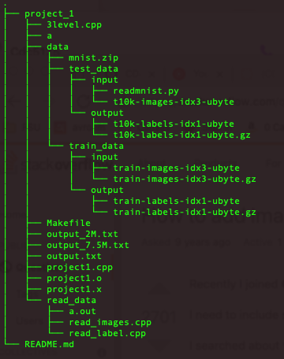

**Project- 2 SSE2 Extension**
- We have have worked to train 10 digits, 0-9.
- By the time we are reporting output after 250000 iteration. Output is as following.

> [Train] Iter 2540000: err =0.0737109, Y = 5  
OO[0] = -0.0455218 
OO[1] = -0.086603 
OO[2] = 0.0713968 
OO[3] = 0.0581853 
OO[4] = 0.361965 
OO[5] = 0.31992 
OO[6] = 0.123416 
OO[7] = -0.175439 
OO[8] = 0.216581 
OO[9] = 0.180579 
Mon Feb  7 22:02:14 2022   
[Train] Iter 2550000: err =0.0853991, Y = 3  
OO[0] = -0.0255604 
OO[1] = 0.53108 
OO[2] = 0.0366608 
OO[3] = 0.259737 
OO[4] = -0.02629 
OO[5] = 0.0247877 
OO[6] = 0.00387791 
OO[7] = 0.0477129 
OO[8] = 0.133934 
OO[9] = 0.0205767 
Mon Feb  7 22:04:44 2022 

- Our configuration for architecture was as followed: 
    - Input size 784
    - First hidden layer size 1000
    - second hidden layer size 500
    - Output layer size 10
    - Activation function A * tanh(B * x). Here, double A = 1.7159 and double B = 0.6666;
    - learning rate r = 0.001
        - Adaptive. after each epoch rate increases by 50%
    - Bias initialized with [-0.05, 0.05 ] based on uniform distribution

- Running the program
    - Download project2.tar
    - >tar -xzvf project2.tar
    - >cd CDA_5125/Project2
    - >make clean
    - >make `[This should compile project2.cpp file and generate  project2.x]`
    - ><i>./project2.x   50000  `[ this will run program for 50000 interattion. Default 700000. You can pass any number as iteration count.]`</i> 
    - Output: output.txt

- MNIST data placement
    
    - Create a folder <i>project_1/data</i> under project_1 directory.
    - Put mnist zip data inside <i>data</i> folder
    - Extract or put training data and testing data folder inside data folder shown in image.
    - Upon unzip train and test folder should be there.
    - We look for data as `./data/train_data/input/train-images-idx3-ubyte`

- Why program is correct?
    - Our objectives in this project is 1. Correctness 2. Speed-up using SSE2 extension.
    - We worked with SSE2 extension over previously done loop optimization which is correct. Thus, if training output matches with previously generated training output then we can say out code is correctly running.
    - Previous loop optimization also achieved high accuracy
    - Our training output at the iteration 2499990 using SSE2 extension is
    - [Train] Iter 249990: err =0.012209, Y = 7 
OO[0] = -1.70617 
OO[1] = -1.71332 
OO[2] = -1.47677 
OO[3] = -1.69759 
OO[4] = -1.71571 
OO[5] = -1.70464 
OO[6] = -1.71578 
OO[7] = 1.63599 
OO[8] = -1.67787 
OO[9] = -1.47818 

    - Output for 249990 iteration our naive code which generates correct result is
    - [Train] Iter 249990: err =0.012096, Y = 7  
OO[0] = -1.70548  
OO[1] = -1.71328  
OO[2] = -1.47885  
OO[3] = -1.69789  
OO[4] = -1.71571 
 OO[5] = -1.70387 
 OO[6] = -1.71578 
 OO[7] = 1.6371 
 OO[8] = -1.67747 
 OO[9] = -1.47821  

    - Again on 0th iteration SSE2 extension output 
    - [Train] Iter 0: err =3.52059, Y = 5 
OO[0] = -0.198916 
OO[1] = 0.416013 
OO[2] = 0.44581 
OO[3] = -0.498763 
OO[4] = -0.254504 
OO[5] = -0.871448 
OO[6] = 0.00294452 
OO[7] = -0.410436 
OO[8] = -0.798785 
OO[9] = 1.09041 

    - And Original correct output
    - Iter 0: err =3.52059, Y = 5  
OO[0] = -0.198916 
 OO[1] = 0.416013 
 OO[2] = 0.44581 
 OO[3] = -0.498763 
 OO[4] = -0.254504 
 OO[5] = -0.871448 
 OO[6] = 0.00294452 
 OO[7] = -0.410436 
 OO[8] = -0.798785 
 OO[9] = 1.09041 
    
- How program achieves high accuracy [ Explanation and calculation of accuracy]
    - We ran 1000 testing from 0-9 digits. Results are as following
    - Total : 97 Correct : 93 Accuracy of 0 is : 95.8763%
	Total : 116 Correct : 111 Accuracy of 1 is : 95.6897%
	Total : 99 Correct : 73 Accuracy of 2 is : 73.7374%
	Total : 93 Correct : 76 Accuracy of 3 is : 81.7204%
	Total : 105 Correct : 91 Accuracy of 4 is : 86.6667%
	Total : 92 Correct : 59 Accuracy of 5 is : 64.1304%
	Total : 94 Correct : 83 Accuracy of 6 is : 88.2979%
	Total : 117 Correct : 98 Accuracy of 7 is : 83.7607%
	Total : 87 Correct : 63 Accuracy of 8 is : 72.4138%
	Total : 100 Correct : 81 Accuracy of 9 is : 81%
 
	Here we can see other than few digits for most of the digits our model can detect correctly. This accuracy can certainly be increased by running the training for higher iterations. Currently, we have ran for 250000.

    - Thus we can see, using SSE2 extension we got a higher accuracy.

- Also wei achieved higher speed up on several unit loops. Details are added on the Report.pdf
- We have run our program in linprog machine.
- Once we finish this run and it generates satisfactory result, we have plan to run it again. So that, we can be sure of generating same result using this configuration.

### Acknowledgement
- While working on this project we want to acknowledge 3level.cpp that was provided by Dr. Xin Yuan. 
- Stackoverflow: https://stackoverflow.com/questions/8286668/how-to-read-mnist-data-in-c?fbclid=IwAR3CAoevTLv6yOu6Ea_Jh5AS9FH441DMQojtYtnpyR7ycmablEUd-19r-30
