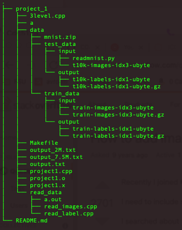

# CDA_5125

This Folder contains all projects done in the course CDA_5125.

**Project - 1:** 

Implementation of a Deep Big Simple Neural Nets Excel on Handwritten Digit Recognition using c/c++.

Keywords: NN (Neural Network) , MLP (Multilayer Perceptron), GPU (Graphics Processing Unit), training set deformations, MNIST 1, BP (back-propagation).

Developed a correct vanilla implementation of a deep neural network from scratch in C or C++ that can be trained to recognize hand-written digit images.

- We have have worked to train 10 digits, 0-9.
- By the time we are reporting output after 2550000 iteration , around 51 epochs. Our plan is to run this for 400 epochs according to paper. Output is as following.

> [Train] Iter 2540000: err =0.0737109, Y = 5  
OO[0] = -0.0455218 
OO[1] = -0.086603 
OO[2] = 0.0713968 
OO[3] = 0.0581853 
OO[4] = 0.361965 
OO[5] = 0.31992 
OO[6] = 0.123416 
OO[7] = -0.175439 
OO[8] = 0.216581 
OO[9] = 0.180579 
Mon Feb  7 22:02:14 2022   
[Train] Iter 2550000: err =0.0853991, Y = 3  
OO[0] = -0.0255604 
OO[1] = 0.53108 
OO[2] = 0.0366608 
OO[3] = 0.259737 
OO[4] = -0.02629 
OO[5] = 0.0247877 
OO[6] = 0.00387791 
OO[7] = 0.0477129 
OO[8] = 0.133934 
OO[9] = 0.0205767 
Mon Feb  7 22:04:44 2022 

- Up on analysing output we are yet to reach into any conclusion if our training is detecting hand written digits with high accuray or not. Since, multiple OO is showing positive result.

- Our configuration for architecture was as followed: 
    - Input size 784
    - First hidden layer size 1000
    - second hidden layer size 500
    - Output layer size 10
    - Activation function A * tanh(B * x). Here, double A = 1.7159 and double B = 0.6666;
    - learning rate r = 0.001
        - Adaptive. after each epoch rate increases by 50%
    - Bias initialized with [-0.05, 0.05 ] based on uniform distribution

- Running the program
    - Download NN-assignment1.tar.gz
    - >tar -xzvf NN-assignment1.tar.gz
    - >cd NN-assignment1.tar.gz/project_1
    - >make clean
    - >make `[This should compile project1.cpp file and generate project1.o and project1.x]`
    - ><i>./project1.x    50000  `[ this will run program for 50000 interattion. Default 700000. You can pass any number as iteration count.]`</i> 
    - Output: output.txt

- MNIST data placement
    
    - Create a folder <i>project_1/data</i> under project_1 directory.
    - Put mnist zip data inside <i>data</i> folder
    - Extract or put training data and testing data folder inside data folder shown in image.
    - Upon unzip train and test folder should be there.
    - We look for data as `./data/train_data/input/train-images-idx3-ubyte`

- How program achieves high accuracy [ Explanation and calculation of accuracy]
    - Our program is still running. We are yet to reach in any conclusion.

- We have run our program in linprog machine.
- Once we finish this run and it generates satisfactory result, we have plan to run it again. So that, we can be sure of generating same result using this configuration.

### Acknowledgement
- While working on this project we want to acknowledge 3level.cpp that was provided by Dr. Xin Yuan. 
- Stackoverflow: https://stackoverflow.com/questions/8286668/how-to-read-mnist-data-in-c?fbclid=IwAR3CAoevTLv6yOu6Ea_Jh5AS9FH441DMQojtYtnpyR7ycmablEUd-19r-30
